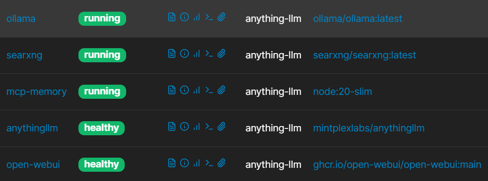

# Ollama / AnythingLLM

This environment is for test purposes.

### Stack:

- Ollama
- Ollama Open WebUI
- AnythingLLM
- MCP
- SearXNG



### Models

Install Models:

```
docker exec -it ollama ollama pull llama3.2:1b
docker exec -it ollama ollama pull nomic-embed-text
docker exec -it ollama ollama pull qwen2.5-coder:1.5b
docker exec -it ollama ollama pull deepseek-coder:1.3b
docker exec -it ollama ollama pull starcoder2:3b
```

Install Embed Model:
```
 docker exec -it ollama ollama pull bge-m3
```
